# 📊 Diagram 1: Declaration vs Initialization
``` mermaid
flowchart TD
    subgraph "Declaration (Creating the variable)"
        direction LR
        A[Just declaring] --> B[Memory allocated]
        B --> C[Variable exists<br>but value is undefined]
    end
    
    subgraph "Initialization (First assignment)"
        direction LR
        D[Assigning first value] --> E[Variable gets actual value]
        E --> F[Now can be used]
    end
    
    subgraph "Reassignment (Changing value)"
        direction LR
        G[Variable exists] --> H[Assign new value]
        H --> I[Old value replaced]
    end
    
    C --> Examples1["let x; // Declaration<br>x = 5; // Initialization"]
    F --> Examples2["const y = 10; // Declaration + Initialization"]
    I --> Examples3["let z = 1; // Declaration + Init<br>z = 2; // Reassignment"
``` 

# 🎯 Diagram 2: What Each Variable Type Allows

```mermaid
flowchart TD
    Start[Variable Operations] --> Types{Variable Type?}
    
    Types --> Const[const]
    Types --> Let[let]
    Types --> Var[var]
    
    %% CONST path
    Const --> C1[Declaration only?]
    C1 -->|No| C2[❌ Must initialize]
    C1 -->|Yes| C3[❌ Not allowed]
    
    Const --> C4[Reassignment?]
    C4 -->|Primitive| C5[❌ Not allowed]
    C4 -->|Object/Array| C6[✅ Modify content allowed]
    
    Const --> C7[Redeclaration?]
    C7 --> C8[❌ Not allowed]
    
    %% LET path
    Let --> L1[Declaration only?]
    L1 --> L2[✅ Allowed: let x;]
    
    Let --> L3[Reassignment?]
    L3 --> L4[✅ Allowed: x = 5;]
    
    Let --> L5[Redeclaration?]
    L5 -->|Same scope| L6[❌ Not allowed]
    L5 -->|Different scope| L7[✅ Allowed]
    
    %% VAR path
    Var --> V1[Declaration only?]
    V1 --> V2[✅ Allowed: var x;]
    
    Var --> V3[Reassignment?]
    V3 --> V4[✅ Allowed: x = 5;]
    
    Var --> V5[Redeclaration?]
    V5 --> V6[✅ Allowed: var x; var x;]
    
    %% Styles
    style C2 fill:#ff4444
    style C3 fill:#ff4444
    style C5 fill:#ff4444
    style C6 fill:#44ff44
    style C8 fill:#ff4444
    style L2 fill:#44ff44
    style L4 fill:#44ff44
    style L6 fill:#ff4444
    style L7 fill:#44ff44
    style V2 fill:#44ff44
    style V4 fill:#44ff44
    style V6 fill:#44ff44
```



# 🔄 Diagram 3: Reassignment Flow


# 📍 Diagram 4: Scope & Redeclaration Rules


# 🕒 Diagram 5: Temporal Dead Zone (TDZ) 

```mermaid
    flowchart LR
    subgraph "Operation Matrix"
        direction TB
        O1[Redeclaration] --> M1["var: ✅<br>let: ❌ same scope<br>const: ❌"]
        
        O2[Reassignment] --> M2["var: ✅<br>let: ✅<br>const: ❌ primitives<br>✅ object properties"]
        
        O3[Block Scope] --> M3["var: ❌<br>let: ✅<br>const: ✅"]
        
        O4[Hoisting] --> M4["var: ✅ undefined<br>let: ✅ TDZ<br>const: ✅ TDZ"]
        
        O5[Global Property] --> M5["var: ✅ window.varName<br>let: ❌<br>const: ❌"]
    end
    
    subgraph "Code Examples"
        E1["// Redeclaration<br>var x = 1; var x = 2; // ✅<br>let y = 1; let y = 2; // ❌<br>const z = 1; const z = 2; // ❌"]
        
        E2["// Reassignment<br>var a = 1; a = 2; // ✅<br>let b = 1; b = 2; // ✅<br>const c = 1; c = 2; // ❌<br>const obj = {}; obj.x = 1; // ✅"]
        
        E3["// Block Scope<br>if true { var v = 1; }<br>console.logv // ✅ 1<br>if true { let l = 2; }<br>console.logl // ❌ Error"]
    end
    
    style M1 fill:#f0f0f0
    style M2 fill:#f0f0f0
    style M3 fill:#f0f0f0
    style M4 fill:#f0f0f0
    style M5 fill:#f0f0f0
```


# 🔧 Diagram 6: Practical Usage Matrix

```mermaid
flowchart TD
    Start[I want to...] --> Action{What operation?}
    
    Action --> Op1[Declare without value]
    Action --> Op2[Declare + Initialize]
    Action --> Op3[Change value later]
    Action --> Op4[Declare again same name]
    Action --> Op5[Use before declaring]
    
    %% Path 1: Declare without value
    Op1 --> P1{Choose type}
    P1 --> P1a[const]
    P1 --> P1b[let]
    P1 --> P1c[var]
    
    P1a --> R1[❌ Not allowed<br>const x; // Error]
    P1b --> R2[✅ Allowed<br>let x; // x = undefined]
    P1c --> R3[✅ Allowed<br>var x; // x = undefined]
    
    %% Path 2: Declare + Initialize
    Op2 --> P2{All types allow this}
    P2 --> R4["✅ All work:<br>const a = 1;<br>let b = 2;<br>var c = 3;"]
    
    %% Path 3: Change value later
    Op3 --> P3{Choose type}
    P3 --> P3a[const]
    P3 --> P3b[let]
    P3 --> P3c[var]
    
    P3a --> R5["❌ Primitives: No<br>✅ Objects: Modify properties"]
    P3b --> R6[✅ Yes, can change]
    P3c --> R7[✅ Yes, can change]
    
    %% Path 4: Declare again
    Op4 --> P4{Choose type}
    P4 --> P4a[const]
    P4 --> P4b[let]
    P4 --> P4c[var]
    
    P4a --> R8[❌ Never allowed]
    P4b --> R9["❌ Same scope<br>✅ Different scope"]
    P4c --> R10[✅ Always allowed]
    
    %% Path 5: Use before declaring
    Op5 --> P5{Choose type}
    P5 --> P5a[const]
    P5 --> P5b[let]
    P5 --> P5c[var]
    
    P5a --> R11[❌ ReferenceError TDZ]
    P5b --> R12[❌ ReferenceError TDZ]
    P5c --> R13[✅ Returns undefined]
    
    %% Style results
    style R1 fill:#ff4444
    style R2 fill:#44ff44
    style R3 fill:#44ff44
    style R4 fill:#44ff44
    style R5 fill:#ffaa44
    style R6 fill:#44ff44
    style R7 fill:#44ff44
    style R8 fill:#ff4444
    style R9 fill:#ffaa44
    style R10 fill:#44ff44
    style R11 fill:#ff4444
    style R12 fill:#ff4444
    style R13 fill:#44ff44
```


# 🎯 Diagram 7: Decision Tree for Variable Operations

```mermaid
flowchart TD
    subgraph "Example 1: Declaration Patterns"
        A["// Declaration only<br>let score; // ✅<br>var count; // ✅<br>const pi; // ❌"]
        
        B["// Declaration + Initialization<br>let name = 'John'; // ✅<br>var age = 25; // ✅<br>const MAX = 100; // ✅"]
        
        C["// Multiple declarations<br>let x=1, y=2; // ✅<br>var a=1, b=2; // ✅<br>const n=1, m=2; // ✅"]
    end
    
    subgraph "Example 2: Reassignment"
        D["// Changing values<br>let a = 1;<br>a = 2; // ✅ Reassigned<br><br>const b = 1;<br>b = 2; // ❌ Error"]
        
        E["// Object properties<br>const user = {name: 'John'};<br>user.name = 'Mike'; // ✅<br>user.age = 30; // ✅<br><br>user = {}; // ❌"]
        
        F["// Array elements<br>const nums = [1,2,3];<br>nums[0] = 10; // ✅<br>nums.push4; // ✅<br><br>nums = [5,6]; // ❌"]
    end
    
    subgraph "Example 3: Scope & Redeclaration"
        G["// Different scopes OK<br>{<br>  let x = 1;<br>}<br>{<br>  let x = 2; // ✅ Different scope<br>}"]
        
        H["// Same scope NOT OK<br>let y = 1;<br>let y = 2; // ❌ Same scope"]
        
        I["// var always OK<br>var z = 1;<br>var z = 2; // ✅ But confusing!"]
    end
    
    style A fill:#f5f5f5
    style B fill:#f5f5f5
    style C fill:#f5f5f5
    style D fill:#f5f5f5
    style E fill:#f5f5f5
    style F fill:#f5f5f5
    style G fill:#f5f5f5
    style H fill:#f5f5f5
    style I fill:#f5f5f5
```

