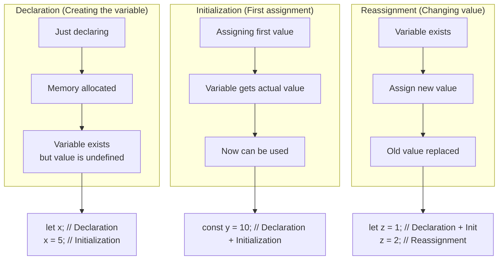

```mermaid
flowchart TD
    Start[Variable Operations] --> Types{Variable Type?}
    
    Types --> Const[const]
    Types --> Let[let]
    Types --> Var[var]
    
    %% CONST path
    Const --> C1[Declaration only?]
    C1 -->|No| C2[❌ Must initialize]
    C1 -->|Yes| C3[❌ Not allowed]
    
    Const --> C4[Reassignment?]
    C4 -->|Primitive| C5[❌ Not allowed]
    C4 -->|Object/Array| C6[✅ Modify content allowed]
    
    Const --> C7[Redeclaration?]
    C7 --> C8[❌ Not allowed]
    
    %% LET path
    Let --> L1[Declaration only?]
    L1 --> L2[✅ Allowed: let x;]
    
    Let --> L3[Reassignment?]
    L3 --> L4[✅ Allowed: x = 5;]
    
    Let --> L5[Redeclaration?]
    L5 -->|Same scope| L6[❌ Not allowed]
    L5 -->|Different scope| L7[✅ Allowed]
    
    %% VAR path
    Var --> V1[Declaration only?]
    V1 --> V2[✅ Allowed: var x;]
    
    Var --> V3[Reassignment?]
    V3 --> V4[✅ Allowed: x = 5;]
    
    Var --> V5[Redeclaration?]
    V5 --> V6[✅ Allowed: var x; var x;]
    
    %% Styles
    style C2 fill:#ff4444
    style C3 fill:#ff4444
    style C5 fill:#ff4444
    style C6 fill:#44ff44
    style C8 fill:#ff4444
    style L2 fill:#44ff44
    style L4 fill:#44ff44
    style L6 fill:#ff4444
    style L7 fill:#44ff44
    style V2 fill:#44ff44
    style V4 fill:#44ff44
    style V6 fill:#44ff44